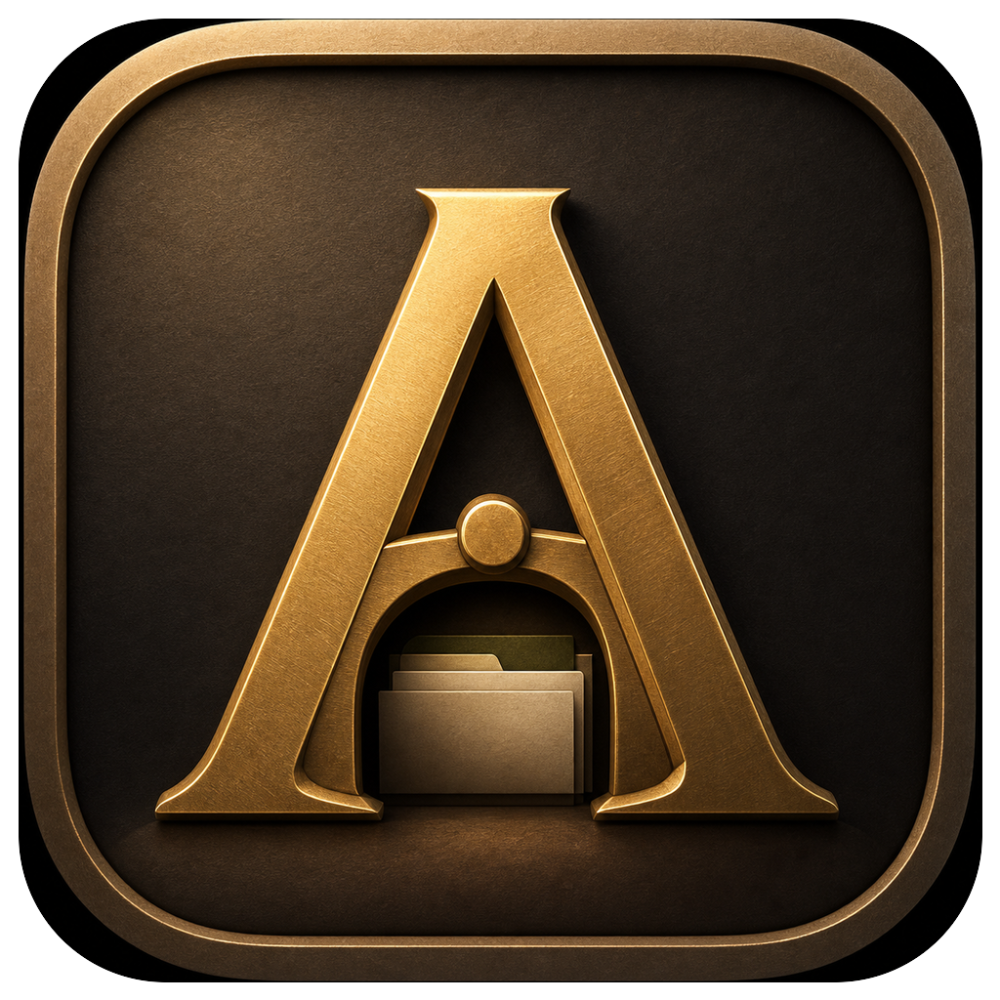
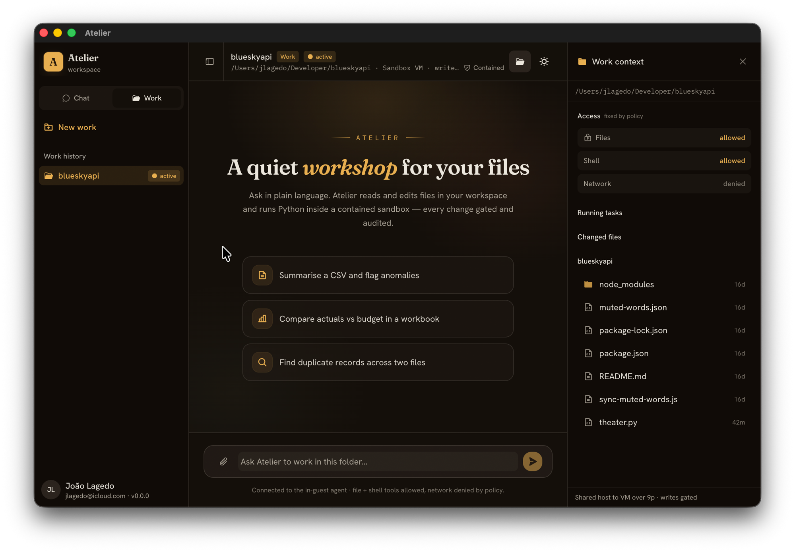

<div align="center">
  
  <h1>Atelier</h1>
  <p><strong>A quiet workshop for your files.</strong></p>
  <p>Ask in plain language. Atelier reads and edits files in your workspace<br>and runs code inside a contained sandbox — every change gated and audited.</p>
  <br/>
  
</div>

---

A desktop AI workspace inspired by [Anthropic's Claude Cowork](https://www.anthropic.com/research/claude-cowork), with its own twists: **cross-OS** (Apple Virtualization.framework on macOS, HCS on Windows), a persistent multi-session model (one VM, N concurrent agent loops), and hibernate/resume to bound memory.

A **Go** host service boots a Linux utility VM, a **TypeScript** agent loop runs Claude *inside* that VM, and an **Electron/React** app is the UI. The agent works on local files safely by **containment** — the VM is the cage, not per-click consent.

## Docs

- [`docs/design.md`](docs/design.md) — full design, decisions, glossary
- [`docs/implementation-status.md`](docs/implementation-status.md) — milestone ladder + current status
- [`CLAUDE.md`](CLAUDE.md) — build/run/test commands, conventions, repo layout

## Architecture

```
Renderer (React, sandboxed)
   │  Electron IPC
Main process (Node) — Session Manager (per-session lifecycle, hibernate/resume)
   │  Named pipe / unix socket — JSON-RPC 2.0
Go host service — broker (policy + audit) + VZ driver (macOS) / HCS driver (Windows)
   │  hvsocket — control / exec / files / net
Linux utility VM — one cage, N sessions: each /sessions/<id> mount + its own agent loop
   ·  tools act on the guest fs; only the model call exits via the egress allowlist
```

## Build

### Prerequisites

| What | Need |
|---|---|
| Real VM | **macOS (Apple Silicon) + VZ** — broker must be codesigned; or **Windows 11 + HCS** (Hyper-V Administrators or elevated) |
| VM image | **Docker** (OrbStack on macOS; WSL2 on Windows), `mke2fs`, `qemu-img` |
| Host broker + guest daemon | **Go 1.25+** |
| Desktop app, agent, codegen | **Node ≥ 22.12** |
| Model calls | **`ANTHROPIC_API_KEY`** in the environment that launches the app |

### Build everything (one command)

```sh
npm run build:all                      # clean build + verify        -> build/debug/
npm run build:all -- --config=release  # stripped + self-contained   -> build/release/
```

`scripts/build-all.mjs` (zero-dep Node) is the single source of truth for the build. It detects your
OS and runs the whole chain from zero — git submodule → protocol codegen → host broker (codesigned
on macOS) → VM image → packaged desktop → verify — writing **every artifact into one tree**,
`build/<config>/`:

```
build/<config>/
  host(.exe), vmctl(.exe)        # Go broker + dev CLI (broker codesigned on macOS)
  image/<target>/                # vmlinuz, initrd, rootfs.raw|vhd, *.origin, manifest.txt
  desktop/                       # packaged Electron app
```

By default this **skips the heavy rootfs/kernel/initrd image** (it changes rarely) and only rebuilds
the small `guestd` volume next to a reused image — pass `--image` to build the whole bundle. Other
flags: `--deep` (also wipe `node_modules` + image cache for a true from-zero), `--no-verify`, and
`--only=host|image|desktop` to build a single phase (`--only=image` always builds the full image).
Then run as below.

### Build one phase at a time

The same orchestrator drives each component — no per-OS build scripts:

```sh
node scripts/build-all.mjs --only=host     # protocol + broker/vmctl (codesigned on macOS)
node scripts/build-all.mjs --only=image    # VM image bundle (Docker; via WSL on Windows)
node scripts/build-all.mjs --only=desktop  # packaged desktop app
```

(`image/build.sh` still runs standalone for image-only hacking; by default it writes to
`image/bundle/<target>/`. The orchestrator redirects it into `build/<config>/image/` via
`ATELIER_OUT_BASE`.)

### Run

```sh
# macOS (Apple Silicon) — broker needs no root (codesigned with the VZ entitlement)
build/debug/host                                                       # broker -> /tmp/atelier-host.sock
ATELIER_BUNDLE_DIR=build/debug/image/darwin-arm64-vz npm run dev       # desktop (ANTHROPIC_API_KEY set)

# Windows — broker must run elevated
build\debug\host.exe
$env:ATELIER_BUNDLE_DIR="build\debug\image\windows-amd64-hyperv"; npm run dev
```

In the app: **Work → New work → pick a folder.** The app boots `vm0`, mounts the folder, opens egress to `api.anthropic.com`, and launches the in-guest agent. Tasks stream in; deliverables land in your folder. Idle sessions hibernate and resume on selection.

### Terminal path (no Electron)

```sh
B=build/debug/image/darwin-arm64-vz   # the bundle dir (use vmctl from build/debug/)
vmctl createVM -id vm0 -kernel $B/vmlinuz -initrd $B/initrd -rootfs $B/rootfs.raw
vmctl startVM  -id vm0
vmctl attachWorkspace -id vm0 -path /path/to/folder
vmctl setEgressPolicy -allow api.anthropic.com
vmctl agent    -id vm0 -- "read orders.csv, write summary.csv"
vmctl stopVM   -id vm0
```

### Test (end-to-end)

```sh
npm run e2e:host                       # build (debug) if needed, boot a VM, drive every broker door
npm run e2e:host -- --config=release   # against build/release/
npm run e2e:host -- --skip-build       # reuse build/<config>/ as-is
```

`scripts/e2e-host.mjs` spawns the real broker, boots `vm0`, and exercises all 12 protocol doors plus
the in-guest agent loop through `vmctl` — both share models (legacy `/workspace` + Files door and
concurrent `/sessions/<tag>`), the egress jail, and host↔guest file bridging both ways. It needs the
same prerequisites as a real run (VZ + codesigned broker + image bundle); the agent check also needs
`ANTHROPIC_API_KEY` and live egress to `api.anthropic.com`.