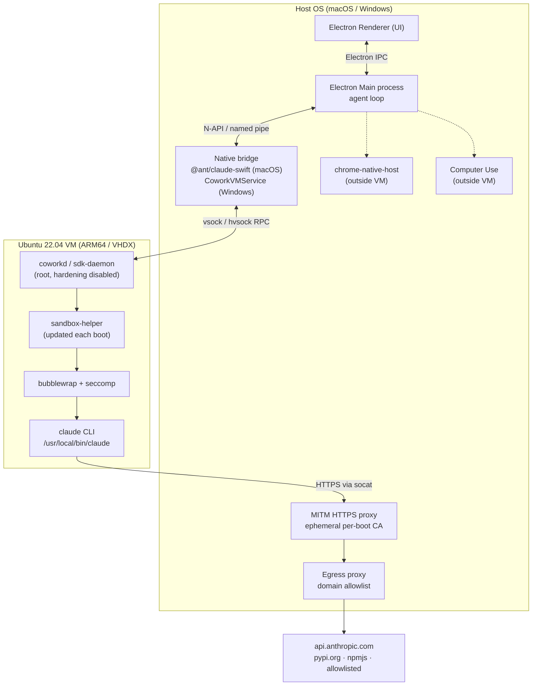
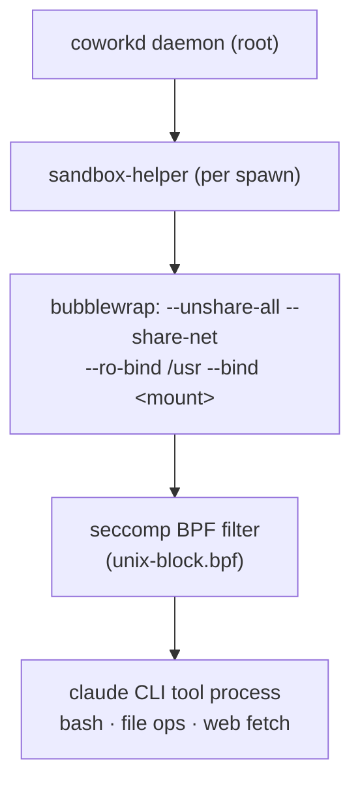
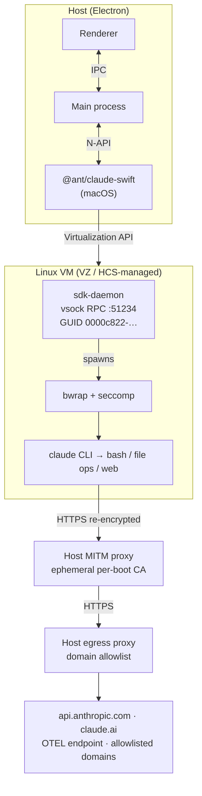
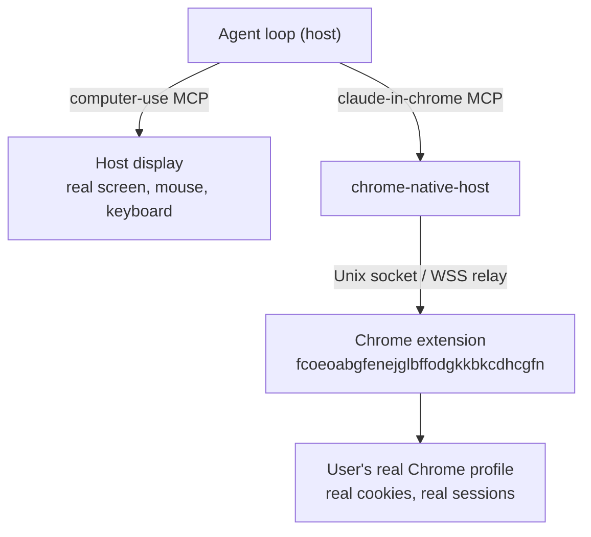
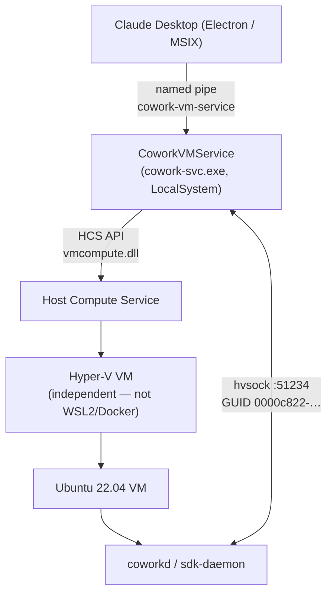
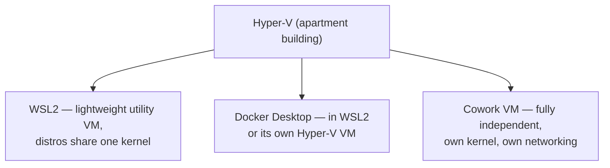

# Inside Claude Cowork: The Desktop Agent Sandbox

> A consolidated reverse-engineering survey of Anthropic's Claude Cowork desktop
> agent sandbox, covering both the macOS and Windows ports.
>
> **Sources:** Anthropic help-center & Trust Center docs, Simon Willison (Jan 12, 2026),
> aaddrick (Jan 26, 2026), Pluto Security / Yotam Perkal (Apr 1, 2026), Jonas Kamsker /
> blog.kamsker.at (Feb 19, 2026), pvieito.com, blog.jimmyvo.com, and GitHub issues on
> `anthropics/claude-code` (#24945, #25513, #26216, #26282, #29887, #29941, #30179,
> #31848, #36298, #36522, #36642, #36801, #37860, #38783, #46661, #51598).
>
> **Snapshot:** January–April 2026. Anthropic ships frequently; minified symbol names,
> flag names, and codenames drift week-over-week. Treat this as point-in-time.

---

## Table of Contents

1. [Executive Summary](#1-executive-summary)
2. [Architecture Overview](#2-architecture-overview)
3. [VM Setup](#3-vm-setup)
4. [Daemons and Processes](#4-daemons-and-processes)
5. [Communication Topology](#5-communication-topology)
6. [Network Security & Egress Control](#6-network-security--egress-control)
7. [Session Architecture](#7-session-architecture)
8. [Filesystem & VirtioFS Mounts](#8-filesystem--virtiofs-mounts)
9. [Tool Surface (MCP)](#9-tool-surface-mcp)
10. [Computer Use & Chrome Control](#10-computer-use--chrome-control)
11. [Pre-installed Software](#11-pre-installed-software)
12. [Disk Usage & Known Bloat](#12-disk-usage--known-bloat)
13. [Feature Flags & Internal Codenames](#13-feature-flags--internal-codenames)
14. [Logging & Forensics](#14-logging--forensics)
15. [Security Model & Disclosures](#15-security-model--disclosures)
16. [Windows-Specific Internals](#16-windows-specific-internals)
17. [Comparison with Adjacent Anthropic Products](#17-comparison-with-adjacent-anthropic-products)
18. [Recommendations](#18-recommendations)
19. [Caveats](#19-caveats)
20. [Glossary](#20-glossary)

---

## 1. Executive Summary

Cowork is a **split-execution desktop agent**. A native Electron app on the host runs
the agent loop (conversation, file I/O on permitted folders, web fetch, Chrome control),
while shell and code execution is forwarded over an RPC channel into a **dedicated
Ubuntu 22.04 Linux VM** booted under the platform hypervisor:

- **macOS** — Apple `Virtualization.framework` (`VZVirtualMachine`), Apple Silicon only.
- **Windows** — Hyper-V via Microsoft's **Host Compute Service (HCS)**, a fully
  independent VM (not WSL2, not Docker's VM).

Inside the VM, a Go daemon (`coworkd` / `sdk-daemon`) further confines tool processes
with **bubblewrap + seccomp** and routes outbound HTTPS through a host-side MITM proxy
with an ephemeral CA and a domain allowlist.

Three load-bearing facts shape everything else:

1. **The VM boundary is the only real security boundary.** Inside the VM, the agent
   daemon runs as root with `NoNewPrivileges=no`, nftables chains are empty, and there
   are no custom AppArmor profiles. Defense-in-depth lives at higher layers (gVisor
   `socket()` block → MITM proxy → host-side allowlist).
2. **Computer Use (screen control) and Chrome control run on the host, *outside* the
   VM sandbox**, against the user's real display and real Chrome profile.
3. **No real-world audit story today.** Cowork is excluded from Audit Logs, the
   Compliance API, and Data Exports on all plans. Only an OpenTelemetry export exists,
   with prompts/tool/MCP names excluded by default. Local logs are world-readable and
   persist full transcripts.

The architecture is publicly confirmed by Anthropic's help-center article *"Claude
Cowork desktop architecture overview"*: the agent loop runs natively on the device,
while "shell commands and any code Claude writes execute inside a dedicated Linux VM,
isolated from the host operating system by the platform's hypervisor."

---

## 2. Architecture Overview



The agent loop and all "intent" live on the host. The VM contains *execution* — it does
**not** contain *intent*. This is why prompt injection is the dominant risk class: the
sandbox confines what code can do, not what the model decides to do.

### Per-process confinement stack (inside the VM)



---

## 3. VM Setup

### 3.1 VM Basics (same base image on both OSes)

| Property | Value |
|---|---|
| OS | Ubuntu 22.04.5 LTS (Jammy Jellyfish), cloud-init instance id `claude-1` |
| Architecture | ARM64 (aarch64) on Apple Silicon — native, no emulation; x64 images also hosted on CDN |
| Kernel | 6.8.0-94-generic (HWE) reported; Ubuntu base typically 5.15.x — not in any authoritative public source |
| vCPUs | 4 |
| RAM | `DEFAULT_VM_RAM_GB = 8` in source; **4 GB** observed actually allocated (3.8–4 GB) |
| Root disk | ~9.6 GB sparse ext4 (GPT: 4 MB BIOS boot + ~106 MB EFI + ~9.9 GB rootfs) |
| Session disk | ~9.8 GB ext4, formatted fresh per boot |
| Boot | EFI / GRUB |
| Connection timeout | `VM_CONNECTION_TIMEOUT_MS = 120000`, `GUEST_POLL_INTERVAL_MS = 100` |

### 3.2 macOS

- **Hypervisor:** Apple `Virtualization.framework` via `VZVirtualMachine`. Runs only on
  **Apple Silicon (arm64), macOS 14+ (Sonoma)** — gated by the `yukonSilver` capability
  check (`process.platform === "darwin" && process.arch === "arm64" && macOS major ≥ 14`).
- **Native bridge:** An Anthropic-built Swift native Node addon, `@ant/claude-swift`,
  dynamically loaded by the Electron main process. It exports a `vm` object with methods:

  ```
  startVM(bundlePath, ramGB)   stopVM()              isGuestConnected()
  installSdk(subpath, version)  spawn(...)            writeStdin(processId, data)
  mountPath(sessionId, hostPath, name, mode)          kill(processId, signal)
  addApprovedOauthToken(token)
  setEventCallbacks(stdout, stderr, exit, error, networkStatus)
  ```

- **VM bundle path:** `~/Library/Application Support/Claude/vm_bundles/claudevm.bundle/`

  ```
  claudevm.bundle/
  ├── rootfs.img            ~10 GB sparse ext4 — Ubuntu root filesystem
  ├── rootfs.img.zst        ~2.3 GB           — compressed download artifact
  ├── sessiondata.img       ~36 MB            — persistent session data (/sessions)
  ├── efivars.fd            128 KB            — UEFI boot variables
  ├── macAddress            17 B              — virtual MAC address
  ├── machineIdentifier     70 B              — unique VM identifier
  └── .rootfs.img.origin    40 B              — SHA1 hash for integrity verification
  ```

- **Bundle download:** zstd-compressed image fetched from
  `https://downloads.claude.ai/vms/linux/{arm64|x64}/{commit_hash}/rootfs.img.zst`,
  SHA-256 verified after decompress. A "warm bundle" pre-download
  (`autoDownloadInBackground`, default `false`) makes first-launch instant. Builds after
  1.1.7714 migrated to `rootfs.vhdx.zst` to share format with Windows; binary deltas
  ship as `smol-bin.x64.vhdx`.
- **Integrity enforcement:** Claude Desktop tracks the SHA1 hash via
  `.rootfs.img.origin`. Any modification to `rootfs.img` triggers automatic VM recreation.
- **Code signing / entitlements:** App carries `com.apple.security.virtualization`.
  Electron fuse hardening: `RunAsNode: Disabled`, `EnableNodeOptionsEnvironmentVariable:
  Disabled`, `EnableEmbeddedAsarIntegrityValidation: Enabled`, `OnlyLoadAppFromAsar:
  Enabled`. Some recent builds shipped without `com.apple.vm.networking`, breaking the
  VM's NAT bridge on Apple M5 hardware (issue #46661).

### 3.3 Windows

See [Chapter 16](#16-windows-specific-internals) for full Windows detail. Summary of
the key macOS↔Windows differences:

| Property | macOS | Windows |
|---|---|---|
| Hypervisor | Apple Virtualization.framework | Hyper-V via Host Compute Service (HCS) |
| VM disk format | `rootfs.img` (sparse ext4) | `rootfs.vhdx` (Hyper-V VHDX, ~9.4 GB) |
| Session disk | `sessiondata.img` | `sessiondata.vhdx` |
| VM manager | `com.apple.Virtualization.VirtualMachine` | `CoworkVMService` (`cowork-svc.exe`) |
| Network | Apple VZ networking + host proxy | WinNAT + HNS virtual switch |
| Kernel shipping | Implicit (VZ boot process) | Explicit `vmlinuz` + `initrd` files |
| File sharing | VirtioFS → `/sessions/<name>/mnt/<folder>` | VirtioFS → `/mnt/.virtiofs-root/shared/` |
| Installer | DMG | MSIX (Store) or non-Store EXE |

### 3.4 Inside the VM (both OSes)

- **Network stack:** gVisor (Google's userspace kernel) provides VM-internal networking,
  with the `socket()` syscall blocked for unprivileged processes.
- **Daemon:** `/usr/local/bin/sdk-daemon` (renamed from `coworkd`) — Go binary ~7 MB,
  systemd unit with `Restart=always`, runs as root. Go deps (from strings):
  `github.com/mdlayher/vsock v1.2.1`, `github.com/mdlayher/socket v0.4.1`,
  `github.com/elazarl/goproxy v1.7.2`.
- **In-VM sandbox:** `@anthropic-ai/sandbox-runtime` v0.0.28 (the open-sourced `srt`
  CLI at `github.com/anthropic-experimental/sandbox-runtime`). On Linux it uses
  `bubblewrap`:

  ```bash
  bwrap --unshare-all --share-net --ro-bind /usr /usr \
        --bind <mount> <mount> --seccomp 3 3<filter.bpf --
  ```

  Ships pre-compiled seccomp BPF in `vendor/seccomp/{arm64,x64}/{apply-seccomp,
  unix-block.bpf}`. `unix-block.bpf` blocks `socket(AF_UNIX, …)` while letting
  `AF_INET`/`AF_INET6` through to be filtered at higher layers. `socat` forwards
  sandbox-localhost to the host proxy's Unix socket.
- **sandbox-helper:** A separate ~2.1 MB binary updated on **every VM boot** —
  `coworkd.log` shows continuous hash changes (`sandbox-helper update detected
  (old=7f74b13e… new=d1b7c599…)`). Exact role beyond seccomp/path enforcement undetermined.
- **The Claude Code CLI is *not* baked into the image.** It is pushed in via
  `vmInterface.installSdk()` RPC at boot to a versioned path.

#### CLI invocation inside the VM

```bash
/usr/local/bin/claude \
  --output-format stream-json \
  --input-format stream-json \
  --model claude-opus-4-5-20251101 \
  --resume <session-uuid> \
  --allowedTools Task,Bash,Glob,Grep,Read,Edit,Write,... \
  --mcp-config '{"mcpServers": {...}}' \
  --permission-mode default \
  --plugin-dir /sessions/<name>/mnt/.skills
```

---

## 4. Daemons and Processes

| Tier | Process / Service | Function |
|---|---|---|
| Host (macOS) | Claude Desktop Electron + `@ant/claude-swift` native addon | Hosts agent loop; manages VM lifecycle via `VZVirtualMachine` |
| Host (macOS) | `chrome-native-host` (`Claude.app/Contents/Helpers/`) | Native messaging bridge for the Chrome extension; Unix socket at `/tmp/claude-mcp-browser-bridge-<user>/<pid>.sock` |
| Host (Windows) | `CoworkVMService` (`cowork-svc.exe`, LocalSystem) | VM lifecycle via HCS; named-pipe RPC; per-request Authenticode self-verification |
| Host (Windows) | Claude Desktop (Electron, MSIX) | Agent loop and renderer |
| Both | Host MITM HTTPS proxy (Unix socket `/var/run/mitm-proxy.sock` on macOS; named pipe on Windows) | Inspects all VM-originated HTTPS; fresh ephemeral CA per boot, key in memory only |
| Both | Host egress proxy (domain allowlist) | Gates `WebFetch` and in-VM shell egress; returns `EGRESS_BLOCKED` JSON or `403` |
| VM | `coworkd` / `sdk-daemon` (systemd) | vsock RPC bridge for spawn/kill/mount/stdin/stdout + embedded goproxy OAuth MITM; root, hardening disabled |
| VM | `sandbox-helper` (~2.1 MB, updated each boot) | Additional sandboxing wrapper for spawned commands |
| VM | `bwrap` + seccomp-wrapped `claude` CLI | The actual tool processes (bash, file ops, web fetch) |
| VM | `socat` | Forwards sandbox-localhost proxy port to host MITM proxy |

### Core daemon hardening (deliberately permissive)

```ini
# /etc/systemd/system/coworkd.service  (a.k.a. sdk-daemon.service)
User=root
Group=root
NoNewPrivileges=no
ProtectSystem=false
ProtectHome=false
PrivateTmp=false
Restart=always
```

The daemon runs as root with all systemd security hardening explicitly disabled. The VM
boundary is the security perimeter — nothing inside the VM adds process-level restrictions
beyond the per-spawn bubblewrap+seccomp wrapper.

### Users inside the VM

- `root` — runs `coworkd`
- `ubuntu` (uid 1000) — base user
- Dynamically created session users (uid ≥ 1001) — one per active session, Docker-style
  random names visible in `/etc/passwd` (e.g. `zealous-bold-ramanujan`)

---

## 5. Communication Topology



### Channel inventory

| Channel | Mechanism | Purpose |
|---|---|---|
| Renderer ↔ Main | Electron IPC | UI events, two contextBridge surfaces (below) |
| Host ↔ VM (macOS) | vsock (inside `@ant/claude-swift`) | Length-prefixed JSON RPC |
| Host ↔ VM (Windows) | hvsock port 51234, GUID `0000c822-facb-11e6-bd58-64006a7986d3` | Same RPC |
| Messages | Unix pipes (stdin/stdout) | JSON stream: user messages & responses |
| HTTP proxy | Unix socket → socat → `:3128` | pip, npm, API calls |
| SOCKS proxy | Unix socket → socat → `:1080` | Other protocols |
| MCP | SDK protocol via pipes | Host MCP servers passed into VM |
| Files | VirtioFS mount | Shared folder access |
| Dispatch (phone→desktop) | SSE via `sessions-bridge` | Routes remote `cse_*` → local `local_ditto_*` |

**VM RPC methods:** `Spawn`, `Kill`, `KillAll`, `Mount`, `Stdin`/`WriteStdin`,
`ReadFile`, `InstallToTrustStore`.

### contextBridge surfaces (renderer)

- **`window.claude.web.LocalAgentModeSessions`** — `start(options)`, `stop(id)`,
  `archive(id, opts)`, `sendMessage(id, msg, images, mcpConfig, connectors)`,
  `respondToToolPermission(id, requestId, approved)`, `getSession`, `getAll`,
  `getTranscript`, `getTrustedFolders`, `add/remove/isFolderTrusted`,
  `setDraftSessionFolders`, `setMcpServers`, `mcpCallTool`, `mcpReadResource`,
  `mcpListResources`, events `onOnEvent`, `onOnToolPermissionRequest`.
- **`window.claude.ClaudeVM`** — `download()`, `getDownloadStatus()`,
  `deleteAndReinstall()`, `startVM(opts)`, `getRunningStatus()`,
  `getYukonSilverConfig()`, `setYukonSilverConfig({autoDownloadInBackground,
  autoStartOnUserIntent, memoryGB})`, events `onDownloadProgress`,
  `onDownloadStatusChanged`, `onRunningStatusChanged`, `onStartupError`.

**OAuth token approval:** Per-spawn, the VM-side proxy validates
`CLAUDE_CODE_OAUTH_TOKEN` against a pre-approved list set via `addApprovedOauthToken()`
before allowing the request through.

---

## 6. Network Security & Egress Control

Three independent layers gate all egress from the VM.

```mermaid
flowchart LR
    P["VM process<br/>(curl / dig / claude)"] -->|socket()| L1{"Layer 1<br/>gVisor"}
    L1 -->|raw socket| X1["BLOCKED<br/>Operation not permitted"]
    L1 -->|HTTPS via socat| L2["Layer 2<br/>MITM proxy<br/>ephemeral CA"]
    L2 --> L3{"Layer 3<br/>domain allowlist"}
    L3 -->|allowed| OK["api.anthropic.com<br/>pypi.org · npmjs"]
    L3 -->|denied| X3["403 blocked-by-allowlist"]
```

### Layer 1 — gVisor syscall blocking

The VM uses gVisor for network virtualization. `socket()` is blocked at the syscall
level for unprivileged processes. Direct DNS, raw TCP, curl — all blocked.

```
$ dig example.com
socket(): Operation not permitted

$ curl https://httpbin.org/get
curl: (56) Send failure: Connection reset by peer
```

The `unix-block.bpf` seccomp filter additionally blocks `socket(AF_UNIX, …)` to prevent
abuse of Unix domain sockets, while permitting `AF_INET`/`AF_INET6` to reach the upper
layers.

### Layer 2 — MITM proxy with ephemeral CA

All outbound HTTPS is intercepted by a host-side MITM proxy:

- Fresh ephemeral CA generated on **each VM boot**
- Private key kept **in memory only**, never written to disk
- CA installed into the VM's system trust store (via `InstallToTrustStore` RPC)
- Traffic routed via Unix socket at `/var/run/mitm-proxy.sock` (macOS) / named pipe (Windows)

### Layer 3 — Host-side egress proxy with domain allowlist

Every `WebFetch` / in-sandbox curl is checked against `coworkEgressAllowedHosts`
(JWT claim `allowed_hosts`). Block responses are JSON
`{"error_type":"EGRESS_BLOCKED","domain":"…","message":"Access to … is blocked by the
network egress proxy."}` or HTTP `403 Forbidden` with `X-Proxy-Error: blocked-by-allowlist`.

| Domain | Status | Purpose |
|---|---|---|
| `api.anthropic.com` | Allowed | Anthropic API (always) |
| `claude.ai`, `downloads.claude.ai`, `bridge.claudeusercontent.com` | Allowed | Anthropic infra |
| `pypi.org` | Allowed | Python packages |
| `registry.npmjs.org` | Allowed | Node packages |
| `github.com` | Allowed in "Package managers only" mode | Source/packages |
| `api.github.com`, `google.com`, any other | Blocked | `403 blocked-by-allowlist` |

Enterprise modes: **Package managers only** (defaults `pypi.org`, `github.com`,
`registry.npmjs.org`) · **Package managers + additional allowed domains** · **All domains**.
MDM key `allowManagedDomainsOnly: true` forces managed-only.

`pip install` and `npm install` work. Arbitrary `curl` does not. `WebSearch` runs
**server-side on Anthropic infra** and never connects from the VM; URLs it returns are
auto-whitelisted for follow-up `WebFetch`. `WebFetch` is allowlist-gated.

> **Exfiltration caveat:** The always-allowed `api.anthropic.com` channel cannot be
> blocked from inside the proxy because Cowork needs it to function — this is the channel
> PromptArmor's invisible-text attack abused ([Chapter 15](#15-security-model--disclosures)).

### Firewall (inside the VM)

`/etc/nftables.conf` contains empty chains with default ACCEPT policies — no firewall
rules inside the VM. Egress security is handled entirely by the three layers above.

```
flush ruleset
table inet filter {
  chain input   { type filter hook input   priority 0; }
  chain forward { type filter hook forward priority 0; }
  chain output  { type filter hook output  priority 0; }
}
```

### AppArmor

`/etc/apparmor.d/` contains only stock Ubuntu profiles (`dhclient`, `rsyslogd`, etc.).
No custom profiles exist for `coworkd`, `sandbox-helper`, or the `claude` binary.

---

## 7. Session Architecture

Sessions use Docker-style random names: `adjective-adjective-scientist`
(e.g. `intelligent-loving-darwin`, `dreamy-optimistic-babbage`, `zealous-bold-ramanujan`).

```
/sessions/
├── intelligent-loving-darwin/   ← session 1 (own Linux user, uid ≥ 1001)
├── dreamy-optimistic-babbage/   ← session 2
└── ...
```

| Resource | Shared between sessions? | Notes |
|---|---|---|
| `/tmp/` | **Yes** | Sessions can see each other's temp files — info-leak surface |
| `/sessions/<name>/` | No | `drwxr-x---` permissions block cross-session access |
| User (UID) | No | Each active session gets its own Linux user (uid ≥ 1001) |
| Kernel / processes | Yes | Same VM, same kernel |
| Network proxy | Yes | Same allowlist rules apply to all sessions |

Inactive sessions show `nobody:nogroup` as owner — sessions are "depersonalized" on close.
Session storage is on an ephemeral disk formatted ext4 at boot.

---

## 8. Filesystem & VirtioFS Mounts

User folders are shared between host and VM via **VirtioFS** (Apple paravirtualized FS /
its Windows equivalent). Each user-approved folder is mounted into the VM, and Claude
Desktop performs path translation in the UI via `translateVMPathToHost()`:

- VM path: `cp report.pdf /sessions/intelligent-loving-darwin/mnt/Downloads/`
- User sees: `cp report.pdf ~/Downloads/`

### Mount taxonomy

| VM path (macOS layout) | Maps to / purpose | Mode |
|---|---|---|
| `/sessions/<name>/mnt/<folder>` | User-selected folder | `rw` (or `rwd` after delete approval) |
| `/sessions/<name>/mnt/outputs` | Session output folder | rw |
| `/sessions/<name>/mnt/uploads` | User-uploaded files | ro |
| `/sessions/<name>/mnt/.projects/<uuid>` | Per-project context | rw |
| `/sessions/<name>/mnt/.plugins/<id>`, `/.local-plugins/<path>` | Installed / local plugins | ro |
| `/sessions/<name>/mnt/.skills` | Skill definitions | ro |
| `/sessions/<name>/mnt/.knowledge/<name>` | Mounted knowledge bases | rw |
| `/sessions/<name>/mnt/.claude` | Claude configuration | rw |
| `/sessions/<name>/mnt/.cowork-lib` | Cowork library | ro |
| `/sessions/<name>/mnt/.cowork-perm-req` | Permission request channel | rw |
| `/sessions/<name>/mnt/.auto-memory` | Auto-memory store | rw |

On **Windows** the layout unifies under a single root: `/mnt/.virtiofs-root/shared/`.

**Mount modes:** `rw` (default) and `rwd` (read-write-delete, requires an additional
permission prompt — the mount is re-issued as `rwd` only after the user approves deletion).

### Non-standard directories

```
/sessions/    — per-session home directories
/smol/bin/    — populated at runtime by coworkd
/workspace/   — empty mount point (sessions binding target)
```

---

## 9. Tool Surface (MCP)

All of Cowork's first-party tooling is exposed via the Model Context Protocol. The in-VM
toolset is identified internally as **`agent_toolset_20260401`** and closely mirrors
Claude Code's.

### In-VM workspace toolset (`mcp__workspace__*`)

- `mcp__workspace__bash` *(verbatim-confirmed in logs)*
- `mcp__workspace__read`, `…__write`, `…__edit`, `…__glob`, `…__grep`
- `mcp__workspace__web_search` — proxies to Anthropic's server-side search; returned URLs
  auto-whitelisted for follow-up fetch
- `mcp__workspace__web_fetch` — subject to host egress allowlist; server-side fetch with
  content extraction (HTML comments and CSS-hidden elements stripped, SVG `<text>` included)

### Cowork directory tool (`mcp__cowork__*`)

- `request_cowork_directory` — triggers the per-directory permission dialog (per-invocation
  gate). On approval calls `vmInterface.mountPath(sessionId, relPath, mountName, "rw")`.
  A separate flow re-mounts as `"rwd"` after the user approves file deletion.
- `allow_cowork_file_delete` — the delete-approval flow.

### Claude-in-Chrome MCP (`mcp__claude-in-chrome__*`, ~19 tools)

| Group | Tools |
|---|---|
| Navigation | `navigate`, `tabs_context_mcp` (read-only, no prompt), `tabs_create_mcp`, `tabs_close_mcp`, `switch_browser`, `resize_window` |
| Content | `read_page`, `get_page_text`, `find`, `screenshot`, `gif_creator` |
| Input | `click_element`/`click`, `type`, `form_input`/`fill_input`, `upload_image`, `file_upload` |
| Dev | `read_console_messages`, `read_network_requests`, `javascript_tool` (arbitrary JS in page context — flagged as a prompt-injection lever) |
| Misc | `shortcuts_list`, `shortcuts_execute`, `update_plan` |

### Computer Use (`computer-use` MCP, host-side)

Requires beta header `computer-use-2025-11-24` (Opus 4.7/4.6/4.5, Sonnet 4.6) or legacy
`computer-use-2025-01-24`. Actions: `screenshot`, `mouse_move`, `left_click`,
`right_click`, `middle_click`, `double_click`, `left_click_drag`, `type`, `key`,
`scroll`, `cursor_position`. Screenshots auto-downscaled (16″ MBP Retina 3456×2234 →
1372×887). UI shows "Claude is using your computer — press Esc to stop." Esc/Ctrl-C aborts.

### Other first-party MCP servers (every session)

`mcp-registry`, `plugins`, `scheduled-tasks`, `session_info`, plus `cowork` and
`Claude in Chrome`. Each registered with `"type": "sdk"`.

### MCP passthrough config

MCP servers configured in Claude Desktop are injected at session spawn via `--mcp-config`.
First-party integrations use UUIDs as server names; third-party/custom use human-readable
names.

```json
{
  "mcpServers": {
    "ea93ae0e-73b4-4d43-9bb0-2c3720b9d627": {"type": "sdk", "name": "Atlassian"},
    "4b26c136-8d30-4046-b6ad-2e41dde789ea": {"type": "sdk", "name": "Slack"},
    "Claude in Chrome": {"type": "sdk", "name": "Claude in Chrome"},
    "cowork": {"type": "sdk", "name": "cowork"}
  }
}
```

**Transport:** stdin/stdout JSON-RPC, multiplexed inside `writeStdin` to the in-VM
`claude` CLI. Control requests (e.g. permission prompts) are tagged
`control_request`/`control_response` and bidirectionally proxied between renderer and VM.

### Plugins / Skills / DXT / MCPB

Cowork supports the same plugin and skill model as Claude Code. Plugins are markdown-based
and can bundle MCP servers, slash commands, sub-agents, and skills. **Desktop extensions
(MCPB/DXT) run as native processes on the host with the user's privileges** — flagged by
LayerX Security in a CVSS-10 disclosure (Anthropic treats it as "outside the threat
model"). MDM keys `isLocalDevMcpEnabled` and `isDesktopExtensionEnabled` let admins
disable local MCP servers and DXTs.

---

## 10. Computer Use & Chrome Control

Both run **on the host, outside the VM sandbox** — this is the single most important
security caveat in the product.



- **Chrome control** uses an opt-in Chrome extension
  (`fcoeoabgfenejglbffodgkkbkcdhcgfn`) talking to a native messaging host
  (`chrome-native-host`) over a Unix socket at
  `/tmp/claude-mcp-browser-bridge-<user>/<pid>.sock`. The agent drives the user's *actual*
  Chrome profile — real cookies, real authenticated sessions.
- **Optional cloud relay:** When LaunchDarkly flag `tengu_copper_bridge` is on, the agent
  connects via `wss://bridge.claudeusercontent.com` instead, enabling cross-device
  control (Dispatch from phone to a different machine). Anthropic generally uses the WSS
  relay even on same-host setups; users can force the local path by disabling the flag.
- **Computer Use** uses the standard Anthropic Computer Use tool API (screenshots +
  mouse/keyboard) against the host display, gated by a 30-minute TTL grant for Dispatch
  (`dispatchCuGrantTtlMs=1800000`).
- **Dispatch (phone → desktop):** The mobile app sends messages to Anthropic's servers;
  the desktop's `sessions-bridge` receives them via SSE and routes into the local
  persistent agent session (`local_ditto_*`). `bridge-state.json` maps remote (`cse_*`) →
  local (`local_ditto_*`) IDs. The "Keep Awake" toggle uses `caffeinate` (macOS) /
  `SetThreadExecutionState` (Windows).

> **Risk model (explicit):** Hidden text on web pages and in screenshots can carry prompt
> injections. This is the "lethal trifecta" (Zenity Labs): Chrome extension exposure to
> web content + access to authenticated accounts + ability to take actions.

---

## 11. Pre-installed Software

### Languages

| Language | Version |
|---|---|
| Python | 3.10.12 |
| Node.js | 22.22.0 (aaddrick's older mount: 18.x) |
| Ruby | 3.0.2 |
| TypeScript | 5.9.3 |
| Java (JVM) | Present (`/usr/lib/jvm`) |

### CLI tools

| Tool | Version | Purpose |
|---|---|---|
| `ffmpeg` / `ffprobe` | 4.4.2 | Video/audio processing |
| `git` | 2.34.1 | Version control |
| `pandoc` | 2.9.2 | Document conversion |
| `ImageMagick` | 6.9.11 | Image manipulation |
| `ripgrep` (`rg`) | — | Fast search (required by sandbox) |
| `socat` | — | Network relay (required by sandbox) |
| `bubblewrap` (`bwrap`) | — | Sandboxing (required by sandbox) |
| `jq` | 1.6 | JSON processing |
| `sqlite3` | — | Embedded database |
| `tesseract` | — | OCR |
| `uv` / `uvx` | — | Fast Python package installer |
| `magika` | — | File-type detection (Google) |

### Python packages (pip — 181 total)

| Category | Packages |
|---|---|
| Data analysis | `pandas` (45 MB), `numpy` (32 MB + `numpy.libs` 27 MB), `matplotlib` (22 MB), `sympy` (30 MB) |
| Computer vision | `opencv-python` (115 MB), `opencv-python-headless` (81 MB) — **both installed, mutually exclusive**; `cv2` (77 MB), `pillow.libs` (14 MB) |
| Video / media | `imageio_ffmpeg` (77 MB) |
| ML inference | `onnxruntime` (49 MB) |
| PDF / document | `pdfplumber`, `camelot-py`, `pdf2txt`/`pdfminer`, `tabula`, `markitdown`, `python-docx`, `img2pdf` |
| Web / scraping | `beautifulsoup4` (`bs4`), `lxml` |
| File detection | `magika` |
| Utilities | `fontTools` (21 MB), `cryptography` (14 MB), `markdown`, `chardetect`, `coloredlogs`, `humanfriendly` |

### Node.js global packages (`/usr/local/lib/node_modules_global` — 192 MB)

| Package | Purpose |
|---|---|
| `docx` | Word document creation |
| `pptxgenjs` | PowerPoint generation |
| `pdf-lib` | PDF manipulation |
| `sharp` | Image processing |
| `@anthropic-ai/sandbox-runtime` v0.0.28 | The `srt` CLI (deps: `@pondwader/socks5-server`, `commander`, `lodash-es`, `shell-quote`, `zod`) |

### Large bundled toolchains

| Path | Size | Purpose |
|---|---|---|
| `/usr/lib/libreoffice` | 319 MB | Headless `.docx`/`.xlsx`/`.pptx` → PDF via `unoserver`/`unoconvert` |
| `/usr/share/texlive` | 286 MB | LaTeX / PDF generation |

The Claude Code CLI itself is **not** baked in — installed at runtime via
`vmInterface.installSdk()`.

---

## 12. Disk Usage & Known Bloat

### Breakdown (fresh image, pre-user)

| Category | Size | % of disk |
|---|---|---|
| System packages (`/usr`) | ~6,400 MB | 67% |
| Snap (dual revisions) | ~1,400 MB | 15% |
| Logs + caches (`/var`) | ~650 MB | 7% |
| Boot + EFI | ~210 MB | 2% |
| **Available for user work** | **~940 MB** | **10%** |

### Largest `/usr` directories

| Path | Size | Notes |
|---|---|---|
| `/usr/lib/firmware` | 1,131 MB | Hardware blobs for devices that don't exist in a VM |
| `/usr/local/lib/python3.10/dist-packages` | 717 MB | 181 pip packages |
| `/usr/lib/modules` | 599 MB | Kernel modules |
| `/usr/lib/libreoffice` | 319 MB | Office conversion |
| `/usr/share/texlive` | 286 MB | LaTeX / PDF |
| `/usr/local/lib/node_modules_global` | 192 MB | Global npm packages |
| `/usr/lib/jvm` | 180 MB | Java |

### Snap packages (each retains current + previous revision)

```
loop0  core20/2682  63.8M     loop3  lxd/38469    91.7M
loop1  core20/2717  63.8M     loop4  snapd/25935  48.1M
loop2  lxd/38331    91.6M     loop5  snapd/26382  48.4M
```

`lxd` = 184 MB ×2 = 368 MB (no purpose in a sandboxed VM).

### `df -h` (issue #37860)

```
Filesystem       Size  Used Avail Use% Mounted on
/dev/nvme1n1p1   9.6G  8.2G  1.4G  86% /
tmpfs            2.0G     0  2.0G   0% /dev
tmpfs            392M  940K  391M   1% /run
/dev/nvme1n1p15  105M  6.1M   99M   6% /boot/efi
/dev/nvme0n1     9.8G  1.3M  9.3G   1% /sessions
```

### Known bloat / bugs (GitHub issues)

| Issue | Description |
|---|---|
| Duplicate OpenCV | `opencv-python` (115 MB) AND `opencv-python-headless` (81 MB) — mutually exclusive, 81 MB wasted |
| LXD snap | 368 MB wasted on a snap with no purpose in a sandboxed VM |
| Snap dual revisions | `snap refresh.retain=1` would save ~200 MB |
| `/usr/lib/firmware` | 1.1 GB of firmware blobs for non-existent physical hardware |
| Plugin cache duplication | Each session copies all plugins to `/sessions/<name>/mnt/.local-plugins/`, never cleaned; 80+ sessions → disk full |
| Per-session pip/npm | Packages install to root partition (`/usr/local/lib/`), don't persist, burn disk every session |

---

## 13. Feature Flags & Internal Codenames

174–178 GrowthBook server-side flags namespaced `tengu_*` are cached in `.claude.json`
per session. Anthropic can flip any capability remotely without a client update.

### Notable flags

| Flag | Effect |
|---|---|
| `chicago_config` | Enables/disables Computer Use per user |
| `clipboardGuard`, `screenshotFilter`, `pixelValidation`, `mouseAnimation` | Computer Use sub-controls |
| `tengu_harbor_ledger` | Communication-channel **deny-list** (Discord, Telegram, iMessage) — not an allowlist |
| `dispatchCuGrantTtlMs=1800000` | 30-min Computer Use TTL for Dispatch grants |
| `tengu_copper_bridge` | Chrome WSS relay vs local socket |
| `tengu_destructive_command_warning` | Disabled in-VM |

### Codenames

| Codename | Component |
|---|---|
| `tengu` | GrowthBook feature-flag namespace |
| `ditto` | Persistent parent agent session (`local_ditto_*`) |
| `chicago` | Computer Use capability |
| `harbor` | Plugin marketplace |
| `yukonSilver` | VM/Cowork platform gate (OS, arch, build, HCS) |
| `yukonSilverGems` | Dependent flag — checks if `yukonSilver` is supported |
| `chillingSloth` | Git worktrees |
| `secureVmFeaturesEnabled` | Enterprise override — can disable VM features |
| `sparkle-hedgehog` | Never-enabled gate, checked hourly |
| `plushRaccoon`, `quietPenguin`, `louderPenguin`, `midnightOwl` | Experimental UI/feature flags (mostly disabled) |

---

## 14. Logging & Forensics

All log files have **`644` (world-readable)** permissions.

### Host logs (macOS — `~/Library/Logs/Claude/`)

| Log | Contents |
|---|---|
| `cowork_vm_node.log` | VM lifecycle, networking status, API reachability |
| `cowork_vm_swift.log` | VM config (CPUs, RAM, rootfs path) logged each boot |
| `coworkd.log` | Session creation, user provisioning, sandbox-helper updates |
| `main.log` | **Full conversation history, user messages in plaintext — survives session deletion** |
| `chrome-native-host.log` | Every socket lifecycle event |

### Per-session artifacts

```
~/Library/Application Support/Claude/local-agent-mode-sessions/<session>/
├── audit.jsonl              — complete tool transcript, thinking chain, inputs/outputs, timing
├── outputs/screenshot-*.jpg — desktop screenshots (~200 KB, 1372×891) — CLEANED on deletion
├── .claude.json             — session config + 174 cached GrowthBook flags
└── remote_cowork_plugins/manifest.json
```

`bridge-state.json` (at AppSupport root) maps remote Anthropic session IDs (`cse_*`) to
local ditto sessions (`local_ditto_*`).

> **Data persistence bug:** Deleting a session from the UI cleans up screenshots but does
> **not** clean up *child* session `audit.jsonl` files (up to 3.5 MB each, world-readable,
> containing complete tool histories including file contents read). `main.log` retains
> full conversation history across all sessions regardless of deletion.

### Compliance posture

Cowork is **excluded** from Audit Logs, the Compliance API, and Data Exports on **all**
plans (Pro, Max, Team, Enterprise). The only enterprise telemetry is an OpenTelemetry
export to a customer-supplied endpoint — and even there prompts, tool names, and MCP
server names are **excluded by default**. Anthropic explicitly warns Cowork is "not
suitable for regulated workloads."

---

## 15. Security Model & Disclosures

### What Anthropic gets right

- Ephemeral CA per VM boot, private key in memory only
- Per-session isolated Linux users (uid ≥ 1001)
- Three-layer network egress control (gVisor → MITM proxy → domain allowlist)
- Per-invocation file-permission gates (tiered, see below)
- Server-side kill switches via GrowthBook
- Visibility-aware page text extraction (strips CSS-hidden elements)
- `rootfs.img` integrity enforcement via SHA1 — modification triggers VM recreation
- Path validation in Electron main (blocks executable extensions, traversal)

### Permission UX (tiered)

| Tier | Access |
|---|---|
| Tier 1 (default) | No file access at all |
| Tier 2 (after folder approval) | Read/write/create inside the mounted folder (`rw`) |
| Tier 3 (high-risk) | File deletion / certain command classes require explicit prompt; mount re-issued as `rwd` |

**Path validation** (Electron main process) blocks `.exe`, `.com`, `.msi`, `.bin`,
`.app`, `.dmg`, `.pkg`, `.jar`; for `openLocalFile` also blocks `.sh`, `.bash`, `.zsh`,
`.command`, `.bat`, `.cmd`, `.ps1`, `.vb`, `.jnlp`, `.js`, `.pl`, `.py`, `.rb`, `.scpt`,
`.applescript`, `.workflow`. Session ID must start with `local_`; path must match
`/sessions/<expectedName>/...`; normalized via `path.posix.normalize` with traversal checks.

### Known weaknesses

- `coworkd` runs as root with all systemd hardening disabled
- No nftables firewall rules inside the VM
- No custom AppArmor profiles for agent processes
- Sessions share `/tmp/` — potential cross-session information leakage
- Child `audit.jsonl` files not cleaned on session deletion (world-readable)
- `main.log` retains full conversation history across sessions regardless of deletion
- **Computer Use and Chrome control run on the host, outside the VM sandbox**
- Dispatch logs contain no device metadata — cannot distinguish phone vs desktop commands

### Documented vulnerabilities / disclosures

| Disclosure | Summary |
|---|---|
| **PromptArmor** (Jan 2026, 2 days after launch) | Invisible-text instruction in a Word doc caused Cowork to silently upload personal docs (incl. partial SSNs) to an attacker-controlled Anthropic account, abusing the always-allowed `api.anthropic.com` egress channel. Reported to Anthropic 3 months earlier, unpatched at launch. |
| **CVE-2025-59536 (CVSS 8.7)** | Check Point Research (Donenfeld, Vanunu), *"Caught in the Hook"* — malicious hooks in `.claude/settings.json` achieved RCE before trust dialogs appeared. Shared code path with Cowork. Fixed in Claude Code 1.0.111 (Oct 2025); disclosed Feb 25, 2026. |
| **LayerX Security** (Feb 9, 2026) | Desktop Extensions (DXTs) run unsandboxed at user privileges — "impacts more than 10,000 active users and 50 DXT extensions." A benign prompt + a maliciously worded calendar event suffices for arbitrary local code execution. Anthropic: "falls outside our current threat model." |
| **Zenity Labs** | The "lethal trifecta" — Chrome extension exposure to web content + authenticated account access + action ability = inherent prompt-injection surface. |
| **Snyk "ToxicSkills"** (Feb 5, 2026) | Of 3,984 skills scanned from ClawHub and skills.sh, 36.82% contained ≥1 security flaw, 13.4% had critical issues (embedded prompt-injection payloads, exposed secrets). |
| Anthropic self-report (Nov 24, 2025) | 1.4% prompt-injection attack-success rate vs Claude Opus 4.5 (was 10.8% for Sonnet 4.5 with prior safeguards). |

---

## 16. Windows-Specific Internals

> Sources: blog.kamsker.at (Feb 2026), GitHub issues #29941, #30179, #36298, #36522,
> #36642, #36801, #51598. Windows GA: April 9, 2026.

### Service architecture



- `CoworkVMService` is a `WIN32_PACKAGED_PROCESS` at
  `C:\Program Files\WindowsApps\Claude_<ver>_x64__pzs8sxrjxfjjc\app\resources\cowork-svc.exe`,
  running as `LocalSystem`. Package-protected — user `sc.exe config` returns access-denied.
- Created via the **HCS API** (`HcsCreateComputeSystem`, `HcsStartComputeSystem`,
  `HcsGetComputeSystemProperties`) through `computenetwork.dll` / `vmcompute.dll`. **Cowork
  VMs do not appear in Hyper-V Manager** — registered at the HCS platform level.
- Required Windows features: `VirtualMachinePlatform` + `HypervisorPlatform`. The full
  `Microsoft-Hyper-V` role is *not* required (HCS suffices) — though some failure modes
  (Server 2022, Home→Pro upgrades) demand the explicit role.

### Control channels

| Channel | Mechanism |
|---|---|
| Host ↔ service | Named pipe `\.\pipe\cowork-vm-service` (polled ~1 s; each call does an Authenticode verify ~960 ms → 17–20% idle CPU burn, issue #31848) |
| Service ↔ VM | hvsock port **51234**, service GUID `0000c822-facb-11e6-bd58-64006a7986d3` (VM connects out on vsock :1024 first, then back to :51234) |
| Daemon console | Named pipe `\.\pipe\cowork-daemon-console-cowork-vm-<id>` → `C:\ProgramData\Claude\Logs\coworkd\user-<SID>.log` |

### Bundle contents (validated checksums)

| File | Size | Purpose |
|---|---|---|
| `rootfs.vhdx` | 9,252,634,624 B (~9.4 GB) | Ubuntu root filesystem (VHDX) |
| `rootfs.vhdx.zst` | 2,326,875,206 B (~2.2 GB) | Compressed download |
| `vmlinuz` | 14,965,128 B (~14 MB) | Linux kernel (explicit on Windows) |
| `initrd` | 175,549,736 B (~167 MB) | Initial RAM disk |
| `sessiondata.vhdx` | 4,194,304 B (4 MB) | Persistent session state |
| `smol-bin.x64.vhdx` | 37,748,736 B (~36 MB) | Runtime binaries (app resources dir) |

**Paths:** MSIX → `%LOCALAPPDATA%\Packages\Claude_*\LocalCache\Roaming\Claude\vm_bundles\
claudevm.bundle\`; non-Store → `%APPDATA%\Claude\vm_bundles\claudevm.bundle\`.

### Networking

Virtual switch `vEthernet (cowork-vm-nat)` on `172.16.0.0/24`, gateway `172.16.0.1`.
**HNS** orchestrates the adapter/switch; **WinNAT** provides outbound NAT.

```powershell
Get-NetNat                                                              # NAT rules exist?
Get-HnsNetwork | Where-Object { $_.Name -eq "cowork-vm-nat" }          # HNS network?
Get-DnsClientServerAddress -InterfaceAlias 'vEthernet (cowork-vm-nat)' # DNS?
```

### Platform detection (`yukonSilver`, from app.asar `nmr()`)

```
1. Platform must be win32 or darwin
2. Architecture must be x64 or arm64
3. MSIX installer required (Windows)
4. Windows build >= 19041
5. getHcsStatus() — HCS must be available
```

On Windows Server 2022, the Hyper-V role must be explicitly installed via
`Install-WindowsFeature`.

### Failure modes & fixes

| # | Failure | Symptom | Fix |
|---|---|---|---|
| 1 | **WinNAT evaporation** (Windows Update / VPN install / Hyper-V reconfig silently drops the rule) | "The Claude API cannot be reached from Claude's workspace." | `New-NetNat -Name cowork-vm-nat -InternalIPInterfaceAddressPrefix 172.16.0.0/24` |
| 2 | **DNS not configured** on adapter after WinNAT loss | No resolution | `Set-DnsClientServerAddress -InterfaceAlias 'vEthernet (cowork-vm-nat)' -ServerAddresses @('1.1.1.1','8.8.8.8')` + `Clear-DnsClientCache` + `Restart-Service CoworkVMService -Force` |
| 3 | **Corrupted `sessiondata.vhdx`** | `host share not mounted at /mnt/.virtiofs-root/shared` → parsed as "CLI output was not valid JSON" | Rename/delete `sessiondata.vhdx`, restart service |
| 4 | **Cross-device EXDEV rename** (#36642, #36522) — `rootfs.vhdx` downloaded to `%TEMP%` then `fs.rename()` to `%APPDATA%` on a different drive | `EXDEV: cross-device link not permitted`; download spinner hangs | Set "Where new content is saved" to C:, or point `TEMP`/`TMP` to a C: path |
| 5 | **MSIX VFS namespace isolation** (#36642) — `AppData\Roaming` virtualized separately from `AppData\Local` | Rename crosses VFS device boundary | Same as #4 |
| 6 | **DCOM 10016** (#30179) — exit code 1066 on Home→Pro upgrades; MSIX container can't activate the Hyper-V COM object | Service fails to start | DCOM permission repair (survives reinstall) |
| 7 | **Windows Home — missing Hyper-V stack** | `New-NetNat` unavailable | Not fully supported on Home |
| 8 | **VPN incompatibility** (Perimeter 81, corporate VPNs) | Routing tables clobber the NAT; can break WSL2 internet | `Get-HnsNetwork \| ? { $_.Name -eq "cowork-vm-nat" } \| Remove-HnsNetwork` |

### Isolation model vs WSL2 / Docker



They share the hypervisor but nothing else — except the documented HNS conflict bug
(#26216) where Cowork's `cowork-vm-nat` HNS network can permanently break WSL2 internet.

### Full reinstall (Windows)

```powershell
sc.exe stop CoworkVMService
sc.exe delete CoworkVMService
Remove-Item -Recurse "$env:APPDATA\Claude"
Remove-Item -Recurse "$env:LOCALAPPDATA\Packages\Claude_*"
# Then reinstall from claude.com/download
```

---

## 17. Comparison with Adjacent Anthropic Products

| Product | Sandbox | Notes |
|---|---|---|
| **Claude Code (CLI)** | `@anthropic-ai/sandbox-runtime` directly on host (sandbox-exec on macOS, bwrap on Linux/WSL2) since v1.0.29 — **no VM** | Same `agent_toolset_20260401`, same Chrome MCP bridge. "Claude code on the web" uses an Anthropic-managed cloud VM per session |
| **Claude Agent SDK / Managed Agents** | Anthropic-hosted container on the Claude Platform | Same toolset & sandbox primitives. Pricing (Apr 9, 2026): Sonnet 4.6 $3/$15; Opus 4.6 & 4.7 $5/$25 per Mtok in/out |
| **Computer Use reference impl** | Docker container (Xvfb + Mutter + Tint2 + Firefox + LibreOffice) | Cowork uses the same model API but against the user's *actual* host display |
| **Linux** | Officially unsupported | `aaddrick/claude-desktop-debian` (stub + planned vsock KVM/Firecracker reusing the x64 rootfs); `patrickjaja/claude-cowork-service` emulates the 22 RPC methods over a Unix socket |

---

## 18. Recommendations

**For technical decision-makers evaluating Cowork:**

1. **Treat Cowork as a desktop-class agent, not a chatbot.** Threat-model it like an RPA
   tool with full local file r/w, browser automation against authenticated sessions, and
   shell execution. The VM contains *execution*, not *intent* — prompt injection is the
   dominant risk class.
2. **Pin to Enterprise for any workforce deployment.** Team/Pro/Max lack the MDM keys
   (`isLocalDevMcpEnabled`, `isDesktopExtensionEnabled`, `coworkEgressAllowedHosts`,
   `allowManagedDomainsOnly`) and OTEL export needed for minimum-viable audit.
3. **Wire OpenTelemetry to your SIEM with verbose mode on** — explicitly opt in to
   recording prompts, MCP/tool/skill names. Default coverage is too thin for SOC-2
   evidence-of-control.
4. **Disable Computer Use and Claude-in-Chrome** until Anthropic ships sandboxed
   equivalents. Both run *outside* the VM, against the live host and the user's real
   Chrome profile — the channels through which observed exfiltration succeeded.
5. **Constrain egress to package-managers-only and add domains case-by-case.** The
   `api.anthropic.com`-as-exfil-channel pattern can't be blocked from inside the proxy;
   mitigate by minimizing what data reaches the agent.
6. **Audit local artifacts.** Push EDR rules over
   `~/Library/Application Support/Claude/local-agent-mode-sessions/` (macOS) and
   `%LOCALAPPDATA%\Packages\Claude_*\LocalCache\Roaming\Claude\` (Windows). Enforce
   FileVault / BitLocker — conversation history is otherwise plaintext at rest.
7. **On Windows: pre-create the `cowork-vm-nat` WinNAT rule via MDM** and document
   recovery for the failure modes in [Chapter 16](#16-windows-specific-internals).

**Benchmarks that would change these recommendations:**

- Audit Log / Compliance API parity for Cowork → relax (3).
- Computer Use moves inside the VM (in-VM Wayland + Xvfb) → relax (4).
- Model-level prompt-injection success rate < 0.1% on industry red-team benchmarks →
  re-evaluate (4) and (5).
- A signed VM rootfs with a TPM attesting daemon hashes → upgrade the trust boundary to
  within-VM as well.

---

## 19. Caveats

- Anthropic Trust Center PDFs ("Claude Cowork Desktop Security Architecture Overview",
  "...Third-Party Platforms") sit behind a Vanta gate; verbatim PDF text is not quoted.
  Architecture content is reconstructed from help-center articles plus independent RE.
- Minified symbol names (`nmr`, `tXe`, `Og`, `wj`, …) are from Electron builds
  1.1.799 / 1.1.5368–1.1.7714 and **rotate every release**; the *behavior* persists, the
  identifiers do not.
- Snapshots differ: aaddrick (Jan 2026), Pluto (Mar 2026), Kamsker/Windows (Feb 2026).
  Chrome MCP socket location, GrowthBook flag names, and codenames drift week-over-week.
- The exact VM kernel version is not in any authoritative public source — only the
  Ubuntu 22.04.5 base (typical 5.15.x); the 6.8.0-94 HWE figure is from one report.
  gVisor's role is documented by Pluto but not confirmed by Anthropic.
- The full egress allowlist has never been published verbatim; only the *modes* and the
  JWT claim name (`allowed_hosts`) are documented. Always-allowed domains are inferred
  from runtime behavior.
- "Cowork" is a recycled brand (Microsoft Copilot Cowork; "Claude for Small Business" is
  a toggle inside Claude Cowork). This document covers only Anthropic's standalone Claude
  Cowork desktop product.
- Verbatim tool names: only `mcp__workspace__bash` is confirmed in the wild; the rest of
  `mcp__workspace__*` is inferred from `agent_toolset_20260401` + Claude Code's toolset.
  The 19 `mcp__claude-in-chrome__*` names come from issues #38783, #37971, #39707 and may
  include renamed/duplicate entries.

---

## 20. Glossary

| Term | Definition |
|---|---|
| **AppArmor** | Linux mandatory-access-control framework. In the Cowork VM only stock Ubuntu profiles exist — no custom profiles for agent processes. |
| **`agent_toolset_20260401`** | Internal identifier for the in-VM MCP toolset, mirroring Claude Code's. |
| **Authenticode** | Microsoft code-signing scheme. `CoworkVMService` self-verifies on each named-pipe call (~960 ms), causing idle CPU burn. |
| **bubblewrap (`bwrap`)** | Unprivileged Linux sandboxing tool. Wraps each spawned tool process with `--unshare-all --share-net` and bind mounts. |
| **`chicago`** | Internal codename for the Computer Use capability. |
| **`chillingSloth`** | Internal codename for git-worktrees support. |
| **CoworkVMService (`cowork-svc.exe`)** | Windows LocalSystem service that manages the VM lifecycle via HCS. |
| **Dispatch** | Phone→desktop control flow; mobile messages relayed via SSE into a local `ditto` session, with a 30-min Computer Use grant TTL. |
| **`ditto`** | Internal codename for a persistent parent agent session (`local_ditto_*`). |
| **DXT / MCPB** | Desktop Extensions — host-native MCP bundles running at the user's privileges (unsandboxed; LayerX CVSS-10 disclosure). |
| **Ephemeral CA** | The MITM proxy's certificate authority, regenerated every VM boot with the private key kept in memory only. |
| **gVisor** | Google's userspace kernel. Provides VM-internal networking and blocks `socket()` for unprivileged processes (Layer 1 egress control). |
| **`harbor`** | Internal codename for the plugin marketplace. |
| **HCS (Host Compute Service)** | Microsoft's low-level VM management API beneath Hyper-V Manager. Cowork VMs are created here and never appear in Hyper-V Manager. |
| **HNS (Host Networking Service)** | Windows service orchestrating the `cowork-vm-nat` virtual switch/adapter. |
| **hvsock** | Hyper-V socket. Windows service↔VM RPC runs on port 51234, GUID `0000c822-facb-11e6-bd58-64006a7986d3`. |
| **MCP (Model Context Protocol)** | Anthropic's tool/resource protocol. All Cowork first-party tooling is exposed as MCP servers (`type: sdk`). |
| **MITM proxy** | Host-side man-in-the-middle HTTPS proxy that decrypts, inspects, re-encrypts all VM-originated HTTPS (Layer 2 egress control). |
| **MSIX** | Microsoft Store packaging format. Introduces VFS namespace isolation that triggers the cross-device EXDEV rename bug. |
| **nftables** | Linux firewall framework. In the VM the ruleset is empty with default ACCEPT — no in-VM firewall. |
| **`NoNewPrivileges=no`** | systemd directive (here disabled) that would otherwise prevent privilege escalation — symptomatic of the deliberately permissive daemon. |
| **OTEL (OpenTelemetry)** | The only enterprise telemetry export for Cowork; prompts/tool/MCP names excluded by default. |
| **seccomp BPF** | Syscall-filtering mechanism. `unix-block.bpf` blocks `socket(AF_UNIX, …)` while allowing INET sockets to reach the upper egress layers. |
| **`sdk-daemon` / `coworkd`** | The in-VM Go daemon (vsock RPC bridge for spawn/kill/mount/stdin + embedded OAuth MITM). Runs as root, hardening disabled. |
| **`sandbox-helper`** | ~2.1 MB binary updated every VM boot; additional per-spawn sandboxing wrapper of undetermined exact scope. |
| **`@anthropic-ai/sandbox-runtime` (`srt`)** | Open-sourced sandboxing CLI (bwrap + seccomp on Linux) used inside the VM and by Claude Code on the host. |
| **sessiondata.img / .vhdx** | Persistent session-state disk, formatted ext4 fresh on each boot. |
| **`sparkle-hedgehog`** | A never-enabled feature gate, checked hourly. |
| **`tengu`** | GrowthBook feature-flag namespace (`tengu_*`); 174–178 flags cached per session. |
| **VHDX** | Hyper-V virtual disk format (`rootfs.vhdx`, `sessiondata.vhdx`) — the Windows equivalent of macOS's `rootfs.img`. |
| **VirtioFS** | Paravirtualized filesystem used to share host folders into the VM. |
| **vsock / virtio socket** | Host↔VM RPC transport on macOS (and VM-side on Windows). Length-prefixed JSON. |
| **WinNAT** | Windows NAT service translating `172.16.0.0/24` VM traffic to the host IP. Prone to silent eviction by Windows Update / VPNs. |
| **`yukonSilver`** | Internal codename for the VM/Cowork platform capability gate (OS, arch, build ≥ 19041, HCS availability). |

---

*Consolidated snapshot, January–April 2026. Sources: Anthropic help-center & Trust
Center, Simon Willison, aaddrick, Pluto Security / Yotam Perkal, Jonas Kamsker,
pvieito.com, blog.jimmyvo.com, and `anthropics/claude-code` GitHub issues.*
